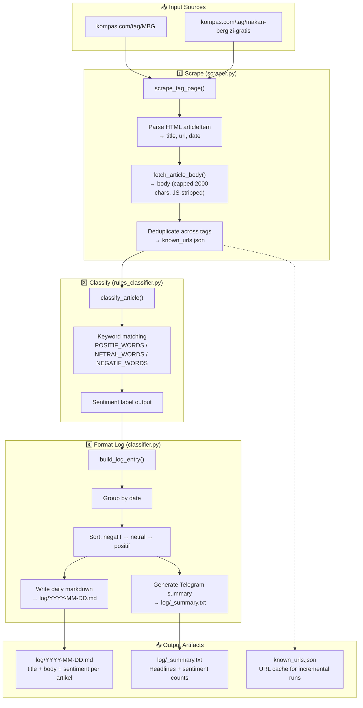

# MBG Scraper — Sentiment Analysis Pipeline

Scrape artikel Kompas.com tentang program **Makan Bergizi Gratis (MBG)** dari dua tag source, klasifikasi sentimen berbasis aturan (rule-based), dan output ke daily log markdown.

> **⚠️ Proyek ini independen** — tidak terhubung dengan vault Obsidian Maewino/Management atau sistem lainnya.

---

## Pipeline Diagram



---

## Project Structure

```
mbg-scraper/
├── scraper.py              # Scraper — fetch tag pages + article bodies
├── rules_classifier.py     # Rule-based sentiment classifier
├── classifier.py           # Log formatter — markdown output + summary
├── run.sh                  # Pipeline orchestrator
├── requirements.txt        # Python dependencies
├── README.md               # This file
│
├── log/                    # Daily sentiment log output
│   ├── 2026-06-22.md
│   ├── 2026-06-21.md
│   ├── _summary.txt
│   └── ...
│
├── state.json              # Last run timestamp
├── known_urls.json         # Known URL cache (deduplication)
│
├── .tmp/                   # Temporary pipeline artifacts
│   ├── scrape_output.json
│   ├── classified.json
│   └── summary.txt
│
└── scripts/                # Reserved for additional scripts
```

---

## File Descriptions

### `scraper.py` — Scraper

Scrapes Kompas.com tag pages and fetches article body text.

| Function | Description |
|----------|-------------|
| `scrape_tag_page(tag_slug, page)` | Parse HTML article listing → `[{title, url, date, snippet}]` |
| `fetch_article_body(url)` | Fetch individual article page, extract `<div class="read__content">` text (2000 chars max); strips Kompas.id JS recommender widget |
| `parse_article_date(date_str)` | Parse Indonesian date format (`"22 Juni 2026"`) → `date` object |
| `extract_date_from_url(url)` | Fallback: extract `YYYY/MM/DD` from article URL |
| `get_max_pages(tag_slug, html)` | Find pagination count from first page (backfill mode) |
| `load_state()` / `save_state()` | Persist last run timestamp |
| `load_known_urls()` / `save_known_urls()` | Persist URL cache for incremental dedup |

**CLI:**
```bash
# Incremental (latest page only)
python3 scraper.py --output articles.json

# Full backfill from Jan 1 to today
python3 scraper.py --backfill --output articles.json
```

**Output:** JSON array per artikel — `{title, url, date, date_str, snippet, source_tag, body}`

---

### `rules_classifier.py` — Sentinel Classifier

Rule-based sentiment classification using Indonesian keyword lexicons tailored for MBG context.

Three keyword lists:
- **`POSITIF_WORDS`** — `berhasil`, `dukung`, `apresiasi`, `manfaat`, `tepat sasaran`, dll.
- **`NEGATIF_WORDS`** — `korupsi`, `gagal`, `kritik`, `demo`, `polemik`, `kendala`, dll.
- **`NETRAL_WORDS`** — `rencana`, `kebijakan`, `program`, `anggaran`, `data`, dll.

| Function | Description |
|----------|-------------|
| `classify_article(title, snippet, body)` | Count keyword matches per category → return `"positif"` / `"netral"` / `"negatif"` |

Heuristic:
- `neg_score > pos_score` AND `neg_score >= 2` → **negatif**
- `pos_score > neg_score` AND `pos_score >= 2` → **positif**
- Otherwise → **netral**

**CLI:**
```bash
python3 rules_classifier.py articles.json --output classified.json
```

**Output:** Same JSON with added `sentiment` field per article.

---

### `classifier.py` — Log Formatter

Formats classified articles into daily markdown log files and generates a Telegram-ready summary.

| Function | Description |
|----------|-------------|
| `group_articles_by_date(articles)` | Group articles by their date string |
| `build_log_entry(date_str, articles)` | Build markdown block for one day: header → sentiment counts → articles sorted negatif→netral→positif |
| `build_summary(articles)` | Generate short Telegram summary (headlines + counts) |

**CLI:**
```bash
# Write daily logs + summary
python3 classifier.py classified.json --log-dir log/

# Telegram summary only (no file writes)
python3 classifier.py classified.json --summary

# Preview formatted log to stdout (no file writes)
python3 classifier.py classified.json --stdout
```

**Log format per artikel:**
```markdown
### 🔴 1. [Judul Artikel](https://...)
**Sentiment:** negatif

> Full article body text (2000 chars max)...
```

---

### `run.sh` — Pipeline Orchestrator

Runs the full pipeline: **scrape → classify → log** sequentially.

```bash
# Incremental (latest page only)
./run.sh

# Full backfill from Jan 1
./run.sh --backfill
```

The Telegram-formatted summary is automatically printed to stdout at the end.

---

## Setup

### Prerequisites
- Python 3.8+
- `pip` (Python package manager)

### Installation

```bash
# 1. Clone repo
git clone <your-repo-url> mbg-scraper
cd mbg-scraper

# 2. Install dependencies
pip install -r requirements.txt

# 3. Run pipeline
./run.sh
```

### Requirements

Create `requirements.txt`:

```txt
requests>=2.28.0
```

---

## Configuration

Key parameters configurable in `scraper.py`:

| Parameter | Location | Default | Description |
|-----------|----------|---------|-------------|
| `TAGS` | Line 27-30 | `["MBG", "makan-bergizi-gratis"]` | Kompas tag slugs to scrape |
| `DATE_START` | Line 35 | `2026-01-01` | Earliest article date to include (backfill) |
| `DATE_END` | Line 36 | `2026-06-22` | Latest article date to include (backfill) |
| `USER_AGENT` | Line 19-22 | Chrome UA string | HTTP User-Agent header |
| Body cap | `fetch_article_body()` line 179 | 2000 chars | Max article body length |
| Rate limit | `scraper.py` line 292 | 0.3s | Delay between body fetches |
| Backfill rate limit | `scraper.py` line 258 | 0.5s | Delay between tag page fetches |

To adjust date range, edit the `DATE_START` and `DATE_END` variables:

```python
DATE_START = date(2026, 1, 1)    # Earliest article
DATE_END = date(2026, 12, 31)    # Latest article
```

To add more tag sources:

```python
TAGS = [
    {"slug": "MBG", "label": "MBG"},
    {"slug": "makan-bergizi-gratis", "label": "makan-bergizi-gratis"},
    # Add more:
    {"slug": "gizi", "label": "gizi"},
]
```

---

## Key Design Decisions

- **No LLM classification** — rule-based keyword matching for speed, offline use, and reproducibility
- **Body fetch is default** — Kompas tag pages don't provide article lead/snippet text; only category labels
- **JS widget cleanup** — Kompas.id inline recommender JS (`var endpoint ... xhr.send()`) stripped from body text
- **Unknown URL tracking** — `known_urls.json` enables incremental runs without re-fetching known articles
- **Exit-safe pipeline** — `run.sh` uses `|| true` on scraper step to prevent `set -e` failures from exit-code-as-return-value pattern

---

## Example Output

**`log/2026-06-22.md`:**
```markdown
# MBG Sentiment Log — 2026-06-22

## 22 June 2026 — 9 artikel

🟢 Positif: 0 | 🟡 Netral: 1 | 🔴 Negatif: 8

### 🔴 1. [Khawatir Nasib Gizi Pelajar, Paguyuban Relawan Bojonegoro Tuntut Program MBG Dilanjutkan](https://surabaya.kompas.com/read/2026/06/22/110028278/...)
**Sentiment:** negatif

> BOJONEGORO, KOMPAS.com – Ribuan orang yang tergabung dalam Paguyuban Relawan Makan Bergizi Gratis (MBG) Kabupaten Bojonegoro...
```

**`log/_summary.txt`:**
```
📊 *MBG Sentiment Report*
📅 22 June 2026

Total: 26 artikel baru
🟢 Positif: 7 | 🟡 Netral: 10 | 🔴 Negatif: 9

*Headlines:*
🟡 [Belajar dari Nepal dan Bolivia...](https://...)
🔴 [Korupsi Selalu Dekat dengan Kekuasaan](https://...)
🔴 [Khawatir Nasib Gizi Pelajar...](https://...)
```
